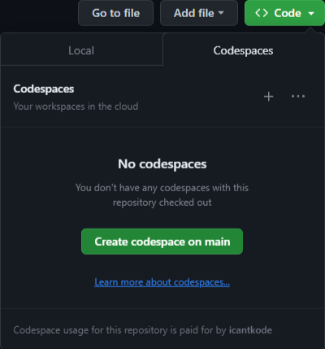

[](https://github.com/codespaces/new?hide_repo_select=true&ref=main&repo=526682619)

# Your Personal Portfolio using React and Github Pages

_Just edit this template and you'll be set._ ✨

The hard part is already done. Using this repository you can set up your very own portfolio website in a matter of minutes. All you have to do is work through the steps.

## An overview of what you'll be doing
1. Creating your own copy of this template.
1. Creating your codespace.
1. Editing this template to include your information.
1. Editing the website template.
1. Deploying the website to github pages, making it avalable for everyone.
<br />

### But before you start, you'll need to:

* **Have a Github account**. If you have one, great, just log in. In case you dont remember the password, create a new account using your NUCES email address. (remove this part incase a gh account is needed to view this file)
* **Fork this repository into your own account.** Forking is like obtaining your own copy of the project and all of its contents. You might wonder if its legal to recreate someone else's project. Good for us, Github is all about open source and collaboration.
* **Start your codespaces container** A container is like a PC running on a remote server that you can access from anywhere, which means that you can write code from anywhere without getting into the fuss of environment setup.


<br />

## Getting Started
What you are provided with is a frontend template made using React framework to help you build your portfolio. The goal is to give you a template that you can immediately utilize.

The repo contains the following:

* `/.devcontainer`
  - `.devcontainer/Dockerfile` Configuration file used by Codespaces to determine operating system of your remote PC and other details.
  - `.devcontainer/devcontainer.json` Configuration file used by Codespaces to configure Visual Studio Code settings, such as the enabling of additional extensions.
* `/__images__` contains all the images, videos and GIFs you used on your webiste.
* `/src` contains all the main code files such as HTML, CSS, JS and others.
* `package.json` and `package-lock.json` contains the information that the project's package manager will need to keep the project's dependencies consistent on every team member's device.

<br />

## Creating your portfolio

1. Fork this repo from this [link](https://github.com/alinadir44/MLSA-Workshop-1)
2. Navigate to the main page of the newly forked repository.
3. Under the repository name, use the Code drop-down menu, and in the Codespaces tab, select "Create codespace on main".

    

    
4. Wait as GitHub initializes the Codespace.

    
    
5. When complete you will see your Codespace load with a terminal section at the bottom. Codespaces will install all the required Visual Studio Code extensions in your container, followed by executing `npm install`. Once the package installs are completed, Codesaces will execute `npm start` to start your web application running within your Codespace. 

   When the web application has successfully started you will see a message in the terminal that the server is running on port 1234 within your Codespace:

   

   A built-in browser will be launched to showcase the current template.
   
[](https://youtu.be/Zbl5oc7Rfug)
   
<br />

## ✨ Customizations!

This project is built to be easily customizable. Each section of the site is a separate component, and your information needs to be set in only one spot. This is not only for ease of updating, but so you can see how prop values are passed to React components.


## 1️⃣ Add your "About me" and social accounts

Within `/src/App.jsx` you will see a variable called `siteProps`. This is a JavaScript object that hold the key value pairs needed to customize your name, title, email, and social accounts.

```javascript
const siteProps = {
  name: "Eleanor Murphy",
  title: "UX Developer & Digital Strategist",
  email: "eleanor@example.com",
  gitHub: "eleanor_dev",
  instagram: "eleanor.designs",
  linkedIn: "eleanor-murphy",
  medium: "eleanor-writes",
  twitter: "eleanor_tweets",
  youTube: "eleanor_creates",
};

```

Update to the name and title you'd like displayed at the top of your site.

_Optional values_ are email address and social accounts. These are used in the `Footer` component. If any item is not included in the list or set to an empty string ("") it will not display the icon and link.

## 2️⃣ Update images

This portfolio site includes 3 images: top section background, "About me" background and portfolio section (desk). These can be any **landscape** sized images of your choosing from your own collection, or found that have a license allowing you to use without attribution.

A couple possible sites to find photos are [Pixabay](https://pixabay.com/) and [Unsplash](https://unsplash.com). Photos, illustrations, vectors, your choice! When you find your images, save each one to `/src/images` with a short, meaningful file name.

Go to the following below components to update the `import image...` line to reference the new image you downloaded for that section, as well as the `imageAltText` for the image:

* `/src/Components/Home.jsx` - section at top of the page, main image you will see when site loads.
   ```javascript
      import image from "../images/[name of your image and extension]";
      const imageAltText = "a description of your image";
   ```
* `/src/Components/About.jsx` - background behind the detailed "About me" section.
   ```javascript
      import image from "../images/[name of your image and extension]";
      const imageAltText = "a description of your image";
   ```
* `/src/Components/Portfolio.jsx`- image highlighted in left hand side of section.
   ```javascript
      import image from "../images/[name of your image and extension]";
      const imageAltText = "a description of your image";
   ```

## 3️⃣ Add your projects and their details

The About section helps to give people a bit more information about your skills and passions. Within `/src/Components/About.jsx` you will find 2 values to update:

* `description`: short sentence or two describing yourself, career goals, and/or passions
* `detailOrQuote`: longer block for you to add more detail about yourself, or even a quote you like

The second section to update is the Portfolio section, where you highlight items you've worked on. These would be articles, videos, logo designs, GitHub projects, anything that highlights you!

Go to `/src/Components/Portfolio.jsx` to the `projectList` variable. This is a JavaScript array of objects. Each item you want to highlight needs: title, description, and URL.

The sample design has 4, but the number you include is up to you.

```javascript
const projectList = [
  {
    title: "title1", 
    description: "Sample description for collaboration to create a beginner-friendly....",
    url: "https://abc.com",
  },
  {
    title: "title2",
    description: "Sample description for contributed sketch note imagery to accompany...",
    url: "https://xyz.com",
  },
  {
    title: "title3",
    description: "Sample description for created from Microsoft's resume workshop...",
    url: "https://bcd.com",
  },
  {
    title: "title4",
    description: "Sample description for video interview to explain when to use GitHub.dev...",
    url: "https://pqr.com",
  },
];

```

<br/>

## 🏃 Deploy your web application
Now that you have edited your template, it's time to deploy it. Deploying it makes it available to other people around the world.

## Azure Static Web Apps

[Azure Static Web Apps](https://azure.microsoft.com/products/app-service/static/?WT.mc_id=academic-79839-sagibbon) is Microsoft's hosting solution for static sites (or sites that are rendered in the user's browser, not on a server) through Azure. This service provides additional opportunities to expand your site through Azure Functions, authentication, staging versions and more.

You'll need both Azure and GitHub accounts to deploy your web application. If you don't yet have an Azure account you can create it from within during the deploy process, or from below links:

* [Create a (no Credit Card required) Azure For Students account](https://azure.microsoft.com/free/students/?WT.mc_id=academic-79839-sagibbon)
* [Create a new Azure account](https://azure.microsoft.com/?WT.mc_id=academic-79839-sagibbon)

With your project open in Codespaces:

1. Click Azure icon in the left sidebar. Log in if you are not already, and if new to Azure, follow the prompts to create your account.
1. From Azure menu click “+” sign and then “Create Static Web App”.
1. If you are not logged into GitHub you will be prompted to log in. If you have any pending file changes you will then be prompted to commit those changes.
1. Set your application information when prompted:
    1. **Region**: pick the one closest to you
    1. **Project structure**: select "React"
    1. **Location of application code**: `/`
    1. **Build location**: `dist`
1. When complete you will see a notification at the bottom of your screen, and a new GitHub Action workflow will be added to your project. If you click “Open Action in GitHub” you will see the action that was created for you, and it is currently running.

1. To view the status of your deployment, find your Static Web App resource in the Azure tab in the VS Code left side bar.
1. Once deployment is complete, you can view your brand new new publicly accessible application by right clicking on your Static Web App resource and selecting "Browse Site".

> **Issues?** When creating your Static Web app, if you are prompted to select an Azure subscription and are not able to select a subscription, check the "Accounts" tab in VS Code. Make sure to choose the "Grant access to ..." options if those options appear. Should you receive the error-message "RepositoryToken is invalid. ..." switch to Visual Studio Code for the Web (vscode.dev) and repeat the steps there.

> 🤩 **Bonus**: [Setup a custom domain for your Azure Static Web App](https://learn.microsoft.com/en-us/shows/azure-tips-and-tricks-static-web-apps/how-to-set-up-a-custom-domain-name-in-azure-static-web-apps-10-of-16--azure-tips-and-tricks-static-w/?WT.mc_id=academic-79839-sagibbon)


## GitHub Pages

GitHub Pages allows you to host websites directly from your GitHub repository. This project is already set up for you to get your portfolio deployed to GitHub pages with minimal steps.

With your project open in Codespaces:

1. Open `package.json` and update the following values:
    1. **homepage**: set to `http://{github-username}.github.io/{repo-name}`, replace `{github-username}` with your GitHub username and `{repo-name}` `with MLSA-Workshop-1`.
    1. **build-gh**: replace `{github-username}` with your GitHub username and `{repo-name}` with `MLSA-Workshop-1`.
1. Commit and push those changes to `package.json` to your GitHub remote repo. To do this, open a new terminal and type in these commands:
```
git add .
git commit -m "My first portfolio, all done!"
git push origin main
```
3. Run `npm run deploy` on the same terminal after the previous commands have finished executing. This will first run the pre-deploy script to build the project, followed by the deploy script that will push those bundled files to a new branch (named gh-pages) on your repo that will be used for you GitHub Pages site.
4. When completed, within your repo, go to Settings -> Pages. There you will see that a page has been set up to for you against the gh-pages branch, and you should see the URL (that should match the “homepage” value you set in package.json)
5. Your website is now live and can be accessed from anywhere with the URL specified by you in the `package.json` file.
6. Navigate to the home page and click on "Download as PDF". This will download your portfolio on to your local system in a PDF format.
<br />

## Contributors
[please add your names here]
Asher


## Conclusion/Thankyou section???